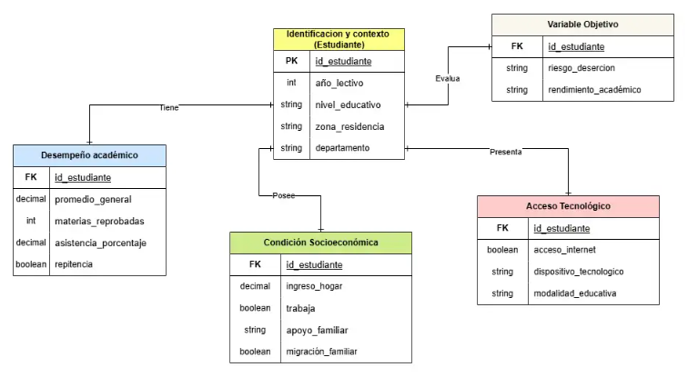

# Plataforma de Análisis Integral del Desempeño Académico y Permanencia Estudiantil

---

## Fases del Proyecto

### 1. Recopilación de Datos
Debido a la confidencialidad de los datos reales, se utilizaron **datasets simulados** que replican el entorno académico de El Salvador. Estos datos se basan en:
* **EHPM:** Encuesta de Hogares de Propósitos Múltiples.
* **Estudios del Banco Mundial:** Análisis sobre pobreza y desigualdad.

[Diagrama de los datos](https://drive.google.com/file/d/1lGCZtPIlKLAortr4YwYZS950bHEfmhZm/view)

[Datos utilizados](https://github.com/ivaniaHer/analitica-desercion-educativa-sv/tree/main/data)

---

### 2. Limpieza y Preparación (ETL)
Se utilizó **Google Sheets** para garantizar la calidad de la información:
* Eliminación de registros duplicados.
* Unificación de tablas para crear una base de datos coherente.
* Preparación de datos para herramientas de visualización.

---

### 3. Arquitectura Visual (Dashboard)
El diseño se desarrolló en dos etapas:

1.  **Figma:** Creación de un prototipo funcional para definir la disposición de los elementos ([UX](https://www.figma.com/proto/HPPeW661UF5EMZeLakI5js/Sin-t%C3%ADtulo?node-id=1-10&p=f&t=ITUh7TkdQk8PeveF-0&scaling=scale-down&content-scaling=fixed&page-id=0%3A1&starting-point-node-id=1%3A10&show-proto-sidebar=1)).

2.  **Looker Studio:** Implementación del estilo visual definitivo y la interfaz de usuario ([UI]()).

---

### 4. KPIs y Filtros Operativos
Se integraron indicadores clave de desempeño (KPI) esenciales para el monitoreo educativo. El dashboard permite segmentar la información mediante filtros dinámicos (zona, nivel académico, ingresos, etc.) para una lectura personalizada.

[No terminados]

---

## Análisis Predictivo con Python y API de ChatGPT

El núcleo técnico avanzado consiste en un script de **Python** que conecta los datos con la **API de ChatGPT**. Este proceso automatiza la identificación de patrones de riesgo.

### Lógica del Modelo de IA
El modelo recibe dos conjuntos de datos:
* **Dataset de Desertores:** Para identificar historias y patrones comunes.
* **Dataset de Estudiantes Activos:** Para aplicar las reglas de predicción.

#### Especificaciones del Prompt:
> 1. **Rol:** Científico de Datos.
> 2. **Tarea:** Generar hipótesis de deserción basadas en patrones observados.
> 3. **Categorización:** Clasificar en riesgo **ALTO, MODERADO y MEDIO**.
> 4. **Cálculo:** Probabilidad de abandono según similitud con el historial de desertores.
> 5. **Salida:** Generación automática de archivos `.csv` y `.json`.

### Reglas de Negocio
* **Enfoque único:** Predecir exclusivamente la deserción escolar.
* **Exclusión:** Se ignora el análisis predictivo de variables no relacionadas directamente con la permanencia (ej. ubicación geográfica o acceso a internet per se).

---

## Tecnologías Utilizadas
* **Lenguajes:** Python (Pandas, API Integration).
* **IA:** ChatGPT API (OpenAI).
* **Visualización:** Looker Studio, Figma.
* **Procesamiento:** Google Sheets.

---

By: jaco-deb

